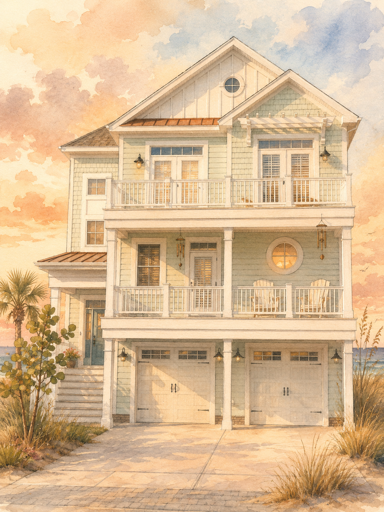

# Chương 2: Những căn phòng

Cánh cổng trắng được đóng lại sau lưng xe bằng một tiếng khô và nhẹ, giống như ai đó vừa đánh chuông nhưng tịt. Hồng ngoái đầu nhìn qua kính sau. Con đường ven biển họ vừa đi qua vẫn còn đó, nhưng càng ngày càng xa, giống như vào hoang đảo, khó thây đường ra vậy.

Minh là người mở cửa xe đầu tiên. Cậu bước xuống, vươn vai thật mạnh rồi huýt sáo khi nhìn căn biệt thự trước mặt.

**Minh:** &quot;Chỗ này mà giá đó hả Vy? Em có chắc tụi mình không bị lừa đem bán qua Cam không?&quot;

**Vy:** &quot;Nếu có bán thì bán anh trước. Nhiều kí chắc bán được giá.&quot; Vy xuống sau, tháo kính mát khỏi tóc, cười một tiếng. 

**Minh:** &quot;Tại em nuôi anh kỹ, anh sắp vô tạ rồi&quot;

Như bật cười. Tiếng cười lẫn với tiếng chuông gió treo dưới mái hiên. Hồng nhìn lên. Chuông làm bằng thuỷ tinh trắng, dây đã ngả màu, mỗi mảnh va vào nhau sẽ tạo nên âm thanh nhỏ và trong đến mức nếu không chú ý sẽ không nghe ra được. Nhưng trời đang không có gió. Mấy tán dương xỉ cạnh bậc thềm đang đứng yên. Tóc Như cũng không lay.

**Lâm:** &quot;Để anh.&quot; Lâm đi vòng sang bên Như, cúi xuống kéo vali cho cô. 

**Như:** &quot;Em tự kéo được mà.&quot;

**Lâm:** &quot;Đồ anh để nặng lắm, để anh cho&quot;

Câu nói bình thường. Hồng tự nhắc mình. Lâm vẫn luôn tốt với người anh yêu, như bất cứ ai đang yêu cũng sẽ tốt với người yêu của mình. Vậy mà lồng ngực cô vẫn có cảm giác bị ai ấn xuống. Cô cúi lấy balo để che khoảnh khắc ấy, rồi tự kéo vali của mình ra khỏi cốp.

Một bàn tay khác chạm vào tay kéo trước cô.

**Thanh:** &quot;Để anh kéo vào cho.&quot; Thanh nói.

Hồng ngẩng lên. Thanh đứng rất gần. Anh chỉ xuất hiện vào những lúc này.

**Hồng:** &quot;Em tự làm được, nhẹ mà.&quot;

**Thanh:** &quot;Nhẹ thì anh làm càng nhanh.&quot;

Anh nói xong liền kéo vali đi trước, không để cô kịp từ chối lần thứ hai. Hồng đi theo sau, vừa ngại vừa biết ơn vì nhờ vậy cô không còn phải đứng nhìn Lâm và Như tung hứng.

Căn biệt thự trắng hơn khi nhìn gần. Lớp sơn ngoài không mới, có vài vết bong ở mép cửa sổ, nhưng tổng thể vẫn sạch sẽ, như thể có người chăm chút kỹ. Mái ngói màu xám xanh, các khung cửa cao, rèm voan buông xuống. Sân trước có một hồ bơi rất trong. Nước trong đến mức có thể soi thấy rõ mặt. Hồng nhìn qua tượng người phụ nữ cầm bình nước và thoáng có cảm giác gương mặt đá quay về phía cô, nhưng khi cô chớp mắt, mọi thứ vẫn nguyên vị trí.

{effect=shake}

Vy mở khóa bằng chìa khoá chủ nhà giấu sẵn. Cửa chính bật ra sau tiếng tạch ngắn. Thứ đầu tiên tràn ra là mùi gỗ pha với tinh dầu bạc hà đã phai. Không phải mùi khó chịu, nhưng nó khiến Hồng nghĩ đến một căn phòng vừa được mở sau nhiều ngày đóng kín.

**Vy:** &quot;Chủ nhà bảo cứ tự nhiên.&quot; Vy bước vào trước, bật đèn phòng khách. &quot;Họ không ở đây. Có gì cần thiết thì nhắn&quot;

**Thanh:** &quot;Không gặp mặt luôn?&quot; Thanh hỏi.

**Vy:** &quot;Ừ. Họ nói đang ở xa. Nhà này cho thuê kiểu tự check-in.&quot;

**Minh:** Minh đặt balo xuống sofa, nhìn quanh. &quot;Tuyệt vời. Một căn nhà ven biển không ai ở, không hàng xóm láng giềng, tự check-in, tự phục vụ. Nếu tối nay mà có ai mất tích thì nhớ là tui đã cảnh báo rồi nha.&quot;

**Vy:** &quot;Anh mà còn nói nữa, người mất tích đầu tiên là anh đó.&quot; Vy đáp.

Phòng khách rộng, trần cao, tường treo nhiều khung ảnh phong cảnh biển. Hầu hết ảnh đều chụp từ xa: bãi cát lúc chiều muộn, mặt nước hồ bơi, một hành lang trắng, mái hiên nhìn ra mưa. Không có ảnh gia đình.

**Vy:** &quot;Phòng ở tầng 1 và 2 nha.&quot; Vy mở điện thoại, đọc lại tin nhắn. &quot;Có bốn phòng dùng được. Hai phòng đôi, hai phòng đơn. Tầng ba còn 2 phòng nữa nhưng chủ nhà ghi không dùng, khóa lại rồi.&quot;

**Minh:** &quot;Sao không dùng?&quot; Minh lập tức hỏi.

**Vy:** Vy nhún vai. &quot;Chắc kho hoặc đang sửa. Người ta ghi vậy thì mình đừng mở.&quot;

**Như:** Như khoác tay Lâm, ánh mắt sáng lên khi nghe đến phòng đôi. &quot;Vậy chia sao?&quot;

Không cần Vy trả lời cũng đoán được. Dù vậy, khoảnh khắc Vy nói thành tiếng vẫn làm Hồng thấy lòng mình trống hẳn.

**Vy:** &quot;Lâm với Như một phòng đôi. Minh với tui một phòng đôi. Hồng một phòng đơn. Thanh một phòng đơn. Vừa đủ.&quot;

**Lâm:** &quot;Hợp lý.&quot; Lâm nói.

**Như:** Như nghiêng đầu dựa vào vai anh. &quot;Em muốn phòng có cửa sổ nhìn ra biển.&quot;

Hồng đứng sau họ hai bậc khi cả nhóm kéo vali lên cầu thang. Cầu thang bằng gỗ, mỗi bước chân vang một tiếng kẽo kẹt rất khẽ. Tầng ba mở ra một hành lang dài, hai bên là cửa phòng màu trắng. Ánh sáng từ cửa sổ cuối hành lang chiếu vào, nhưng không tới được đoạn sâu nhất phía trong. Ở cuối đó có hai cánh cửa đóng kín nằm cạnh nhau, tay nắm bằng đồng tối màu. Không dán biển "không dùng", không có dây chắn, chỉ đóng im. Vậy mà ngay khi nhìn thấy chúng, Hồng đã biết đó là hai phòng Vy vừa nhắc.

Không khí trên hành lang lạnh hơn phòng khách. Hồng nghĩ vì máy lạnh trung tâm, nhưng cạnh cổ tay cô nổi gai rất nhẹ. Thanh đi ngay phía sau, tay vẫn kéo vali của cô. Anh cũng nhìn về phía trên tầng 3.

**Thanh:** &quot;Lạnh thật.&quot; Anh nói nhỏ.

**Hồng:** Hồng quay sang. &quot;Anh cũng thấy lạnh hả?&quot;

**Thanh:** &quot;Ừ. Đoạn cuối lạnh hơn.&quot;

**Hồng:** &quot;Chắc do máy lạnh.&quot;

Thanh không phản bác, nhưng ánh mắt anh vẫn ở lại hai cánh cửa phía trên lâu hơn một chút.

Vy mở phòng đầu tiên. Căn phòng rộng, giường đôi phủ drap trắng, cửa sổ nhìn chéo xuống sân và một góc biển xa. Như vừa bước vào đã reo lên.

**Như:** &quot;Phòng này đẹp quá.&quot;

**Lâm:** Lâm kéo vali vào theo cô. &quot;Lấy phòng này đi.&quot;

**Như:** &quot;Không cần hỏi mọi người hả?&quot; Như quay ra, nhưng giọng cô chỉ là lịch sự.

**Minh:** Minh phẩy tay. &quot;Hai người lấy đi. Tụi tui còn cả kỳ nghỉ để nghe hai người cảm ơn bằng cách rửa chén cho mọi người.&quot;

**Vy:** Vy đá nhẹ vào giày Minh. &quot;Anh tự rửa phần anh trước đi.&quot;

Như cười, kéo Lâm sâu hơn vào phòng. Cửa chưa đóng, nhưng cảnh hai người đứng bên nhau trong phòng làm Hồng bỗng thấy mình như người nhìn lén một điều vốn không dành cho mình. Cô quay mặt đi rất nhanh.

**Vy:** &quot;Phòng Hồng ở đây.&quot; Vy mở cửa kế bên. &quot;Phòng đơn, nhưng rộng. Cạnh phòng Lâm với Như cho tiện.&quot;

Cho tiện. Hai chữ ấy đập vào Hồng một cách chính xác. Phòng cô nằm sát phòng Lâm và Như, chỉ cách một bức tường. Cách sắp xếp ấy không cố ý, nhưng đôi khi những điều vô tình lại dường như cố ý.

**Hồng:** &quot;Cũng được.&quot; Hồng nói trước khi ai hỏi.

**Vy:** Vy nhìn Hồng rồi hỏi thêm. &quot;Nếu bà muốn đổi thì nói nha. Phòng Thanh bên dưới cũng là phòng đơn nhưng nhỏ hơn.&quot;

**Hồng:** &quot;Phòng này được rồi.&quot;

Hồng nói nhanh hơn mình muốn. Nếu chậm thêm một chút, cô sợ mọi người sẽ nghe ra phần còn lại: rằng cô muốn đổi, nhưng không muốn ai biết lý do.

Thanh kéo vali vào giúp cô. Phòng của Hồng nhỏ hơn phòng đôi nhưng sáng. Một giường đơn lớn đặt sát tường, bàn trang điểm cũ cạnh cửa sổ, tủ áo hai cánh, một chiếc ghế mây và một kệ sách thấp không có sách. Cửa sổ nhìn ra hông nhà, nơi dây hoa giấy phủ xuống bức tường rào. Từ đây không thấy biển, chỉ thấy một đoạn sân phụ lát đá và bóng của chuông gió.

**Hồng:** &quot;Cảm ơn.&quot; Hồng nhận lại vali.

**Thanh:** Thanh đặt tay lên tay kéo thêm một nhịp rồi mới buông. &quot;Nếu phòng lạnh quá thì đổi với anh.&quot;

**Hồng:** &quot;Phòng anh ở đâu?&quot;

**Thanh:** &quot;Phía dưới, tầng 1.&quot; Anh chỉ xuống. &quot;Xa phòng hai người kia hơn một chút.&quot;

Hồng hiểu anh muốn nói gì, dù anh không nói thẳng. Cô cũng hiểu anh đã nhìn thấy vẻ mặt cô lúc Vy chia phòng. Sự tử tế ấy khiến cô khó xử hơn là được an ủi.

**Hồng:** &quot;Em được mà&quot;

**Thanh:** Thanh gật đầu. &quot;Ừ. Khi nào không ổn thì nói anh.&quot;

Anh rời phòng, khép cửa lại nhưng không đóng hẳn. Hồng đứng giữa căn phòng lạ, nghe tiếng nhóm bạn tiếp tục chia nhau các ngăn tủ ngoài hành lang. Tiếng Minh than vì phòng cậu và Vy không có view đẹp bằng phòng Lâm. Tiếng Vy bảo cậu bớt diễn. Tiếng Như gọi Lâm xem cảnh biển. Những âm thanh đời thường ấy đáng lẽ phải làm căn nhà ấm lên. Nhưng càng nghe, Hồng càng cảm thấy mình bị đặt vào một vị trí rất rõ: gần đủ để đau, xa đủ để không có quyền lên tiếng.

Cô mở vali, lấy vài bộ đồ treo vào tủ. Trong tủ có mùi long não cũ. Ở góc dưới cùng, cô thấy một chiếc móc áo gỗ gãy một nửa. Hồng cầm lên rồi đặt lại, tự hỏi vì sao người dọn phòng không bỏ nó đi. Có lẽ căn nhà này có nhiều thứ nhỏ bị bỏ quên như vậy.

Một tiếng cười của Như vọng qua tường, rất gần.

**Như:** &quot;Lâm, anh xem bộ đồ tắm này được không.&quot;

Giọng Lâm đáp lại thấp hơn, không rõ chữ. Hồng đứng im, tay vẫn cầm áo. Cô ghét bản thân vì nghe thấy. Ghét hơn nữa vì chỉ cần một câu mơ hồ của Lâm cũng đủ làm cô tưởng tượng ra nét mặt anh lúc nói. Cô treo áo lên, kéo khóa vali mạnh hơn cần thiết.

Hồng rửa mặt trong phòng tắm nhỏ. Nước từ vòi ban đầu lạnh buốt, sau đó mới ấm dần. Cô nhìn mình trong gương. Mặt cô vẫn bình thường: tóc hơi rối, mắt hơi mệt vì đi đường dài, môi không cười. Không có dấu hiệu nào nhưng bên trong cô đang bị kéo căng như một sợi dây đàn.

Khi cô ra hành lang, Minh đang đứng trước hai phòng đã khoá, một tay cầm lon nước, vẻ tò mò hiện rõ.

**Minh:** &quot;Ê, hai phòng này khóa thiệt nè.&quot;

**Vy:** Vy từ cầu thang ngẩng lên. &quot;Minh.&quot;

**Minh:** &quot;Anh chỉ kiểm tra an ninh thôi.&quot;

**Vy:** &quot;An ninh là anh tránh xa nó ra.&quot;

**Minh:** Minh giơ hai tay đầu hàng nhưng vẫn cúi nhìn khe cửa. &quot;Lạnh ghê. Đứng đây như đứng trước tủ đông.&quot;

Thanh đứng cách đó vài bước, không đùa theo. Anh nhìn tay nắm cửa. Hồng bước đến gần, và ngay lập tức cảm thấy nhiệt độ hạ xuống. Không lạnh kiểu máy lạnh thổi vào mặt. Lạnh này từ dưới sàn, men theo cổ chân, luồn vào da. Cửa phòng bên trái có một vết xước nhỏ gần ổ khóa, mảnh như vết móng tay. Cửa bên phải sạch hơn, nhưng phía dưới khe cửa tối đặc, không hắt ra chút ánh sáng nào dù hành lang khá sáng.

**Thanh:** &quot;Chủ nhà có nói trong đó để gì không?&quot; Thanh hỏi.

**Vy:** Vy lắc đầu. &quot;Không. Chỉ nói không cần dùng. Nhà rộng vậy, thiếu gì chỗ.&quot;

**Minh:** &quot;Không cần dùng khác với không được mở.&quot; Minh nói.

**Vy:** &quot;Và tụi mình sẽ chọn cách lịch sự là không mở.&quot; Vy đáp, giọng vẫn nhẹ nhàng.

**Như:** Như bước ra từ phòng đôi, đã thay váy mỏng màu kem. Cô ôm lấy cánh tay Lâm, hỏi: &quot;Mọi người làm gì ở trên đó vậy?&quot;

**Vy:** &quot;Minh muốn bắt đầu phim kinh dị sớm.&quot; Vy nói.

**Như:** &quot;Không nha.&quot; Như rùng mình rồi kéo Lâm lùi lại. &quot;Em ghét mấy phòng khóa kiểu này lắm.&quot;

**Lâm:** Lâm bật cười, đặt tay lên vai cô. &quot;Không ai mở đâu.&quot;

Câu nói ấy đáng lẽ hướng đến cả nhóm, nhưng ánh mắt anh lướt qua Hồng khi nói.

**Vy:** &quot;Xuống dưới đi.&quot; Vy nói. &quot;Tui có đem đồ ăn rồi. Tối nay khỏi nấu.&quot;

Cả nhóm quay về phía cầu thang. Hồng đi sau cùng, nhưng khi vừa bước được hai bước, cô nghe một tiếng động nhỏ từ căn phòng bên trái. Không phải tiếng gõ. Giống tiếng một vật bằng gỗ chạm nhẹ vào tường, rồi trượt xuống rất chậm.

Cô dừng lại.

Thanh cũng dừng. Anh quay đầu nhìn cô trước, rồi nhìn hai cánh cửa.

**Hồng:** &quot;Anh nghe không?&quot; Hồng hỏi khẽ.

**Thanh:** &quot;Có&quot; Thanh gật đầu. 

Ở dưới, mọi người vẫn đang bàn về tối nay ăn gì

Hồng không trả lời ngay. Cô nhìn hai cánh cửa. Chúng vẫn đóng. Tay nắm không động. Khe cửa vẫn tối.

**Thanh:** &quot;Chắc đồ trong phòng rơi.&quot; Thanh nói, nhưng giọng anh không chắc.

**Hồng:** &quot;Ừ.&quot; Hồng nói.

Hai người đi xuống. Phòng khách sáng hơn lúc mới vào, nhưng khung ảnh trên kệ gần cầu thang làm Hồng khựng lại.

Ban đầu nó úp mặt sát mặt kệ, nằm ngay ngắn theo chiều ngang. Bây giờ một góc khung đã lệch ra ngoài mép gỗ, như vừa bị ai đẩy nhẹ từ phía sau. Không đủ rơi. Chỉ đủ để một người đi ngang, nếu lỡ nhìn quá kỹ, nhận ra nó đã di chuyển.

Hồng nhìn quanh. Không ai ở gần kệ ảnh.

Tiếng chuông gió dưới mái hiên vang lên một lần nữa. Một âm rất nhỏ, trong và lạnh.

Sau lưng Hồng, khung ảnh lại nhích thêm một chút.
